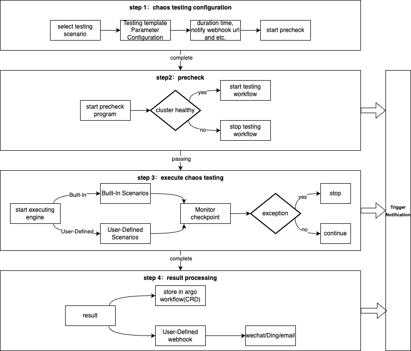

# Kubernetes Chaos Testing Playbooks Guide

[English](README.md) | [中文](README_zh.md)

## Background

Kubernetes' centralized architecture and declarative management model, while enabling efficient operations, also introduce critical risks of cascading failures. The open ecosystem (with third-party components like Flink and Rancher) and complex multi-service environments further exacerbate these risks:

- Cascading deletion disaster: A customer using Rancher to manage Kubernetes clusters accidentally deleted a namespace, which subsequently deleted all core business workloads and Pods in the production cluster, causing service interruption.
- Control plane overload: In a large OpenAI cluster, deploying a DaemonSet monitoring component triggered control plane failures and coredns overload. The coredns scaling depended on control plane recovery, affecting the data plane and causing global OpenAI service disruption.
- Data plane's strong dependency on control plane: In open-source Flink on Kubernetes scenarios, kube-apiserver disruption may cause Flink task checkpoint failures and leader election anomalies. In severe cases, it may trigger abnormal exits of all existing task Pods, leading to complete data plane collapse and major incidents.

These cases are not uncommon. The root cause lies in Kubernetes' architecture vulnerability chain - a single component failure or incorrect command can trigger global failures through centralized pathways. 

To proactively understand the impact duration and severity of control plane failures on services, we should conduct regular fault simulation and assessments to improve failure response capabilities, ensuring Kubernetes environment stability and reliability. 

This project provides Kubernetes chaos testing capabilities covering scenarios like node shutdown, accidental resource deletion, and control plane component (etcd, kube-apiserver, coredns, etc.) overload/disruption, it will help you minimize blast radius of cluster failures.

## Prerequisites

1. Prepare two Kubernetes clusters: `src cluster` (for executing testing workflows) and `dest cluster` (the target cluster for testings).

**dest cluster**

2. Create `tke-chaos-test/tke-chaos-precheck-resource ConfigMap` in `dest cluster` as a marker for testing eligibility:
```bash
kubectl create ns tke-chaos-test && kubectl create -n tke-chaos-test configmap tke-chaos-precheck-resource --from-literal=empty=""
```

**src cluster**

3. Obtain `dest cluster`'s internal kubeconfig from Tencent Cloud TKE Console, save to `dest-cluster-kubeconfig` file, then create secret in `src cluster`:
```bash
kubectl create ns tke-chaos-test && kubectl create -n tke-chaos-test secret generic dest-cluster-kubeconfig --from-file=config=./dest-cluster-kubeconfig
```

4. Clone this project and then deploy Argo Workflow in `src cluster` (skip if Argo is already deployed, [**Argo Documentation**](https://argo-workflows.readthedocs.io/en/latest/)):
```bash
# Clone this project
git clone https://github.com/tkestack/tke-chaos-playbook.git && cd tke-chaos-playbook

# Deploy Argo Workflow
kubectl create -f playbook/install-argo.yaml

# Verify Argo Workflow Pod status
kubectl get po -n tke-chaos-test
```

5. Enable public access for `tke-chaos-test/tke-chaos-argo-workflows-server Service` in Tencent Cloud TKE Console. Access Argo Server UI at `LoadBalancer IP:2746` using credentials obtained via:

Note: If the cluster restricts public access, please configure the Service for internal access and connect via internal network.

```bash
# Get Argo Server UI access token
kubectl exec -it -n tke-chaos-test deployment/tke-chaos-argo-workflows-server -- argo auth token
```


## Quick Start

The Kubernetes Control Plane fault simulation Playbook is an automated pipeline built on Argo Workflow.

Using `kube-apiserver overload` as an example:

- Create kube-apiserver overload workflow:
```bash
kubectl create -f playbook/rbac.yaml && kubectl create -f playbook/all-in-one-template.yaml
kubectl create -f playbook/workflow/apiserver-overload-scenario.yaml
```



**Core Workflow Explanation**

- **Testing Configuration**: Before execution, you may need to configure parameters like `webhook-url` for notifications. Default values are provided so testings can run without modification. See [Scenario Parameters](playbook/README.md) for details.
- **Precheck**: Before execution, `dest cluster` health is validated by checking Node and Pod health ratios. Testings are blocked if below thresholds (adjustable via `precheck-pods-health-ratio` and `precheck-nodes-health-ratio`). Also verifies existence of `tke-chaos-test/tke-chaos-precheck-resource ConfigMap`.
- **Execute Testing**: During kube-apiserver overload testing, the system floods `dest cluster`'s kube-apiserver with List Pod requests to simulate high load. Monitor kube-apiserver metrics via Tencent Cloud TKE Console and observe your business Pod health during testing.
- **Result Processing**: View testing results in Argo Server UI (recommended) or via `kubectl describe workflow {workflow-name}`.

### Deleting Tests
```bash
kubectl delete -f playbook/workflow/apiserver-overload-scenario.yaml
```

## Roadmap

| Supported Features                         | Priority | Status      | Planned Release | Description                                                     |
|--------------------------------------------|----------|-------------|-----------------|-----------------------------------------------------------------|
| apiserver overload                         |   -      | Completed   |      -          | Simulate kube-apiserver high load                               |
| etcd overload                              |   -      | Completed   |      -          | Simulate etcd high load                                         |
| apiserver overload (APF)                   |   -      | Completed   |      -          | Add Expensive List APF Policy,Simulate kube-apiserver high load |
| etcd overload (ReadCache/Consistent cache) |   -      | Completed   |      -          | Add Etcd Overload Protect Policy, Simulate etcd high load       |
| coredns disruption                         |   -      | Completed   |      -          | Simulate coredns service disruption                                 |
| kubernetes-proxy disruption                |   -      | Completed   |      -          | Simulate kubernetes-proxy disruption                                |
| accidental deletion scenario               |   -      | Completed   |      -          | Simulate accidental resource deletion                           |
| TKE managed cluster kube-apiserver disruption     |   -      | Completed   |      -          | Simulate kube-apiserver disruption                                  |
| TKE managed cluster kube-scheduler disruption      | -       | Completed   |      -          | Test scheduling behavior during scheduler failure               |
| TKE managed cluster kube-controller-manager disruption     | -       | Completed   |      -          | Validate controller component failure scenarios                 |
| TKE Self-Maintenance Cluster master node shutdown  | P1       | In Progress |  2025-06-30     | Simulate master node poweroff                                   |
| etcd disruption                                | P1       | In Progress |  2025-06-30     | Simulate etcd cluster failure                                   |

## FAQ
1. Why use two clusters for fault simulation?

  Testings are orchestrated using Argo Workflow, which follows a CRD-based pattern heavily dependent on kube-apiserver. Using a single cluster for fault simulation (especially apiserver/etcd overload or disruption tests) would make kube-apiserver unavailable, preventing Argo Workflow Controller from functioning and halting the entire workflow.

2. How to track testing progress after starting?

  Monitor testing progress via Argo Server UI or `kubectl get -n tke-chaos-test workflow`. By default, testings run in the `tke-chaos-test` namespace. You can also watch fault simulation Pods via `kubectl get -n tke-chaos-test po -w` - Error-state Pods typically indicate testing failures that can be investigated via Pod logs.

3. What are common failure reasons?

  Typical issues include: insufficient RBAC permissions for fault simulation Pods, missing `tke-chaos-test/tke-chaos-precheck-resource ConfigMap` in target cluster, missing `tke-chaos-test namespace`, or Argo workflow controller anomalies. Check fault simulation Pod or Argo Workflow Controller logs for details.

4. How to troubleshoot Argo Workflow Controller issues?

  When workflows show no status after creation via `kubectl get workflow`, the Argo workflow-controller is likely malfunctioning. Check controller logs via:
```bash
kubectl logs -n tke-chaos-test deployment/tke-chaos-argo-workflows-workflow-controller --tail 50 -f
```
  Many cases involve insufficient RBAC permissions - modify the corresponding ClusterRole to add required permissions.
