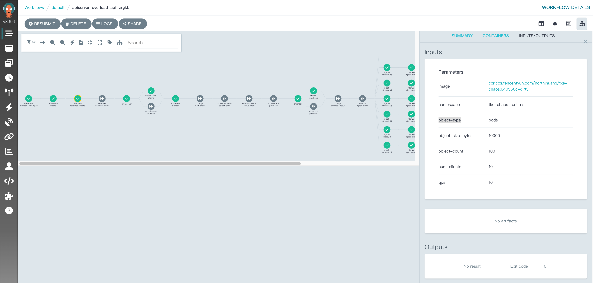
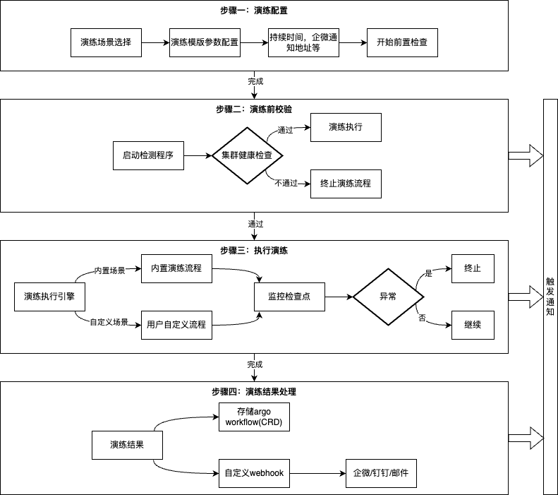

# Kubernetes故障演练Playbooks指南

[English](README.md) | [中文](README_zh.md)

## 背景

`K8s`的中心化架构和声明式管理模式，在带来高效运维的同时，也引入了链式故障扩散的致命风险。开放性生态（如`Flink`、`Rancher`等第三方组件）与多业务复杂性进一步加剧隐患：

- 级联删除灾难：某客户使用`Rancher`管理`K8s`集群，误删某个`namespace`后，导致生产集群核心业务`workload`、`Pod`等资源后全部被删除，导致业务中断。  
- 控制面过载：`OpenAI`大集群在部署了`DaemonSet`监控组件后，引发控制面故障、`coredns`过载，`coredns`扩容又依赖控制面恢复，导致数据面受影响，`OpenAI`全球业务出现中断。  
- 数据面强依赖控制面：开源`Flink on K8s`场景中，`kube-apiserver`中断可能会导致`flink`任务`checkpoint`失败，选主异常，严重情况下还可能会触发所有存量任务`Pod`异常退出，数据面全线崩溃，进而引发重大故障。 

类似的案例并非少数，这些风险的本质是`K8s`架构的脆弱性传导链，一次组件异常、一条错误指令，都可能通过中心化链路引发全局故障。

为了提前掌控控制面故障对业务的影响时长和严重程度，我们应定期开展演练与评估，提升业务对故障的应对能力，为`K8s`环境的稳定性和可靠性提供强有力的保障。

本项目围绕上述场景提供K8s故障演练相关能力，支持节点关机、资源误删除、控制面组件（如etcd、kube-apiserver、coredns等）过载和停服等演练场景，帮助你降低集群故障爆炸半径。

## 前置条件

1. 您需要准备两个`K8s`集群`源集群`和`目标集群`，`源集群`用于执行演练流程，`目标集群`作为被演练集群。

**目标集群**

2. 在`目标集群`中创建`default/tke-chaos-precheck-resource ConfigMap`，该资源用于标识`目标集群`可执行演练测试，同时在`目标集群`中创建`tke-chaos-test-ns namespace`
```bash
kubectl create -n default configmap tke-chaos-precheck-resource --from-literal=empty="" && kubectl create ns tke-chaos-test-ns
```

**源集群**

3. 从腾讯云`TKE控制台`获取`目标集群`的内网接入`kubeconfig`凭证写入到`dest-cluster-kubeconfig`文件，并在`源集群`中执行如下命令创建`目标集群`的`kubeconfig`的`secret`
```bash
kubectl create secret generic dest-cluster-kubeconfig --from-file=config=./dest-cluster-kubeconfig
```

4. 在`源集群`中部署`Argo Workflow`和演练模版（如`Argo`已部署，则不需要重复部署`Argo`，[**Argo Documentation**](https://argo-workflows.readthedocs.io/en/latest/)）
```bash
# 部署Argo Workflow
kubectl create namespace tke-chaos-argo && kubectl create -f playbook/install-argo.yaml

# 验证Argo Workflow Pod正常运行
kubectl get po -n tke-chaos-argo
```

5. 腾讯云`TKE控制台`开启`tke-chaos-argo/tke-chaos-argo-workflows-server Service`公网访问，浏览器访问`LoadBalancer IP:2746`，执行如下命令获取的`Argo Server UI`接入凭证登录`Argo UI`，`Argo UI`可查看演练流程的详细信息。
```bash
# 获取Argo Server UI接入凭证
kubectl exec -it -n tke-chaos-argo deployment/tke-chaos-argo-workflows-server -- argo auth token
```



## 快速开始

`K8s`控制面故障演练`Playbook`是基于`Argo Workflow`构建的自动化演练流水线。

以下将以`kube-apiserver高负载`故障场景为例说明演练流程。

- 创建`kube-apiserver`高负载故障演练`workflow`：
```bash
kubectl create -f playbook/rabc.yaml && kubectl create -f playbook/all-in-one-template.yaml && kubectl create -f playbook/workflow/apiserver-overload-scenario.yaml
```




**核心流程说明**

- **演练配置**：在开始执行演练前，您可能需要配置一些演练参数，如配置`webhook-url`参数配置企微群通知，参数均提供了默认值，您可以在不修改任何参数的情况下执行演练。各演练场景参数说明见[演练场景参数配置说明](playbook/README.md)
- **演练前校验**：开始执行演练之前，会对`目标集群`做健康检查校验，检查演练集群中的`Node`和`Pod`的健康比例，低于阈值将不允许演练，您可以通过修改，`precheck-pods-health-ratio`和`precheck-nodes-health-ratio`参数调整阈值。同时会校验`目标集群`中是否存在`default/tke-chaos-precheck-resource ConfigMap`，如不存在将不允许演练。
- **执行演练**：`kube-apiserver`高负载演练执行过程中，会对`目标集群`的`kube-apiserver`发起大量的洪泛`List Pod`请求，以模拟`kube-apiserver`高负载场景，您可以访问`腾讯云TKE控制台`的`目标集群`核心组件监控，查看`kube-apiserver`的负载情况。同时，您应该关注演练过程中您的业务Pod的健康状态，以验证`kube-apiserver`高负载是否会影响您的业务。
- **演练结果**：您可以访问`Argo Server UI`查看演练结果（推荐），您也可以执行`kubectl describe workflow {workflow-name}`查看演练结果。

### 停止测试
```bash
# 停止测试
kubectl get workflow
kubectl delete worflow {workflow-name}
```

## 功能规划路线图

| 支持功能                         | 优先级  | 当前状态     | 计划发布时间  | 描述                                                |
|------------------------------|--------|------------|---------------|---------------------------------------------------|
| apiserver高负载演练               |   -   |      完成     |      -       | 模拟kube-apiserver服务高负载                             |
| etcd高负载演练                    |   -   |      完成     |      -       | 模拟etcd服务高负载                                       |
| apiserver高负载演练(增加APF策略保护）    |   -   |      完成     |      -       | 增加Expensive List APF过载保护策略，并模拟kube-apiserver服务高负载 |
| etcd高负载演练(增加etcd过载保护策略)      |   -   |      完成     |      -       | 增加etcd过载保护策略，并模拟etcd服务高负载                         |
| coredns停服                    |   -   |      完成     |      -       | 模拟coredns服务中断场景                                   |
| kubernetes-proxy停服           |   -   |      完成     |      -       | 模拟kubernetes-proxy服务中断场景                          |
| 资源误删除场景                      |  P0   |    开发中     |  2025-05-30  | 模拟资源被误删除场景                                        |
| kube-apiserver停服演练           |  P0   |    开发中     |  2025-06-15  | 模拟kube-apiserver服务中断场景                            |
| etcd停服演练                     | P0    |    开发中     |  2025-06-15  | 模拟etcd集群故障场景                                      |
| kube-scheduler停服演练           | P0    |    开发中     |  2025-06-15  | 测试调度器故障期间的集群调度行为                                  |
| kube-controller-manager停服演练  | P0    |    开发中     |  2025-06-15  | 验证控制器组件故障场景                                       |
| cloud-controller-manager停服演练 | P0    |    开发中     |  2025-06-15  | 验证控制器组件故障场景                                       |
| master节点停机                   | P1    |    开发中     |  2025-06-15  | 模拟master关机场景                                      |


## 常见问题
1. 为什么要用两个集群来执行演练测试?

  演练是基于`Argo Workflow`工作流进行编排的，`Argo Workflow`是CRD的开发模式，强依赖`kube-apiserver`。如果使用一个集群进行演练，如进行apiserver/etcd高负载或停服实验时，`kube-apiserver`将不可用，这将导致`Argo Workflow Contrller`无法正常工作，整个工作流无法正常执行。

2. 演练开始执行后，如何知道演练执行到哪个步骤了?

  您可以访问`Argo server UI`查看演练流程，您还可以执行`kubectl get workflow`查看工作流的执行状态。演练默认在default命名空间下执行，您还可以通过执行`kubectl get po -w`命令查看执行演练的`Pod`的执行情况，当出现`Error`状态的`Pod`时，大概率演练失败，您可以查看对应`Pod`日志进行排查。

3. 演练失败具体有哪些原因?

  常见的错误包括如：执行演练的Pod`RBAC`权限不足问题、被测集群中用于校验的`default/tke-chaos-precheck-resource ConfigMap`不存在、被测集群中资源创建的`tke-chaos-test-ns namespace`不存在、`Argo workflow控制器`异常等。您可以排查演练`Pod`或`Argo Workflow Controller`的日志进行排查。

4. `Argo Workflow Controller`异常排查?

  当演练工作流创建后，通过`kubectl get workflow`查看工作流，工作流无状态时，此时大概率是`Argo workflow-controller`不工作，可以通过`kubectl logs -n tke-chaos-argo deployment/tke-chaos-argo-workflows-workflow-controller --tail 50 -f`查看`Argo Workflow Controller`的报错信息，很多情况下是RBAC权限不足，您应该修改对应的ClusterRole添加对应的资源权限。
